# User's Guide

## Introduction

PowerAuth Web Flow is used for authentication and authorization of various operations in the web browser. 
The most typical use case is protection of PSD2 APIs using strong customer authentication (SCA).

The following operations are fully configured by default:
- `login` - user authentication, in PSD2 terminology an `AISP` operation granting access to the bank account information 
- `authorize_payment` - user authentication followed by payment authorization, in PSD2 terminology a `PISP` operation initiating a payment transaction

These two operations are described in details in the following sections.

Web Flow can also be used for additional purposes, such as:
- user authentication and consent approval for providing user identity (the `bank ID` use case)
- user authentication and payment authorization during 3D secure operations when paying online with a credit card
- any other case of OAuth 2.0 or Open ID Connect (OIDC) standard based authentication

Documentation of these additional scenarios are out of scope of this user's guide.

## Operation Steps

Each operation consists of multiple steps depending on configuration of the operation, such as:
- `user authentication` - user specifies the username, then enters the password and SMS authorization code or alternatively uses two-factor authentication in Mobile Token
- `payment authorization` - payment details are displayed after the user was authenticated and the user approves the operation using password and SMS authorization code or two-factor authentication in Mobile Token
- `consent approval` - the screen shows consent information and consent options, the user either approves or rejects the consent by interacting with the consent form

In order for an operation to succeed, all defined steps need to be completed successfully. The user is redirected back 
to the original application once all steps have succeeded. In case any of the steps fails, the user is redirected back to the
original application with an error. 

## Authorization Instruments

The authorization of individual operation steps can be performed using following instruments:
- `Authorization SMS and Password` - the user receives a generated one time code (OTP) in SMS message, which is used for authorizing the operation. 
In order to satisfy `SCA` requirements of two-factor authentication in PSD2 legislation, a user password is required together with the SMS OTP code. 
Note: The requirement to specify user password can be avoided in case anti-fraud integration is used in Web Flow and an authentication step-down to 
one factor is performed for given operation step. In case of non-SCA operations, the password is not required, too.
- `Mobile Token` - the user receives a push message on mobile device and authorizes the operation step. The authorization is performed 
by one of available options in the application and is protected by strong cryptography:
  - Numeric PIN code
  - Fingerprint verification (Touch ID on iOS)
  - Face recognition (Face ID on iOS)
- `Hardware Token` - integration is not yet available, however it will be available in a future release

## Authorization Using SMS OTP

The first SMS message is sent automatically when a step with SMS authorization appears. There are 5 attempts to enter the 
OTP code which was sent in the SMS message. In case all attempts to authorize the operation step using OTP code fail,
the whole operation fails. 

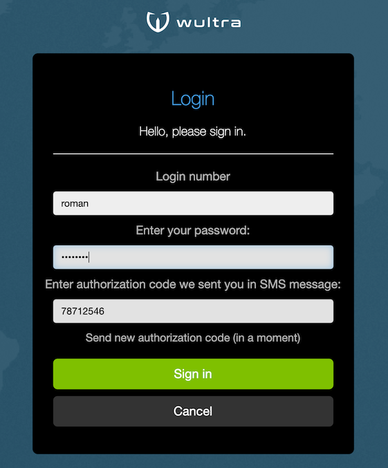

The user can request to resend the authorization SMS after 1 minute after previous SMS message was sent. 

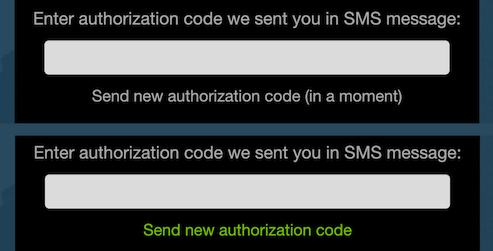 

The OTP code is generated as a hash created from operation data with a random key. The digest value is digitized into 
8 digits, unless the code length is configured otherwise. Each sent SMS contains a new OTP code. The original OTP code
is valid until a new authorization SMS is sent. 


## Authorization Using Mobile Token 
 
The Mobile token authentication requires an application installed on user mobile device which is paired
with PowerAuth server before the operation is started. This process is called `Activation` in PowerAuth terminology. 
Furthermore the mobile token must be configured and enabled, see chapter about [mobile token configuration](./Mobile-Token-Configuration.md).

The Mobile Token can be used in two modes:
- `Online mode`: used when the user has internet access on mobile device, the operation is confirmed from mobile device. The user does not see the authorization code, it is computed using keys on the mobile device and verified by calling PowerAuth server directly using a two-factor signature. 

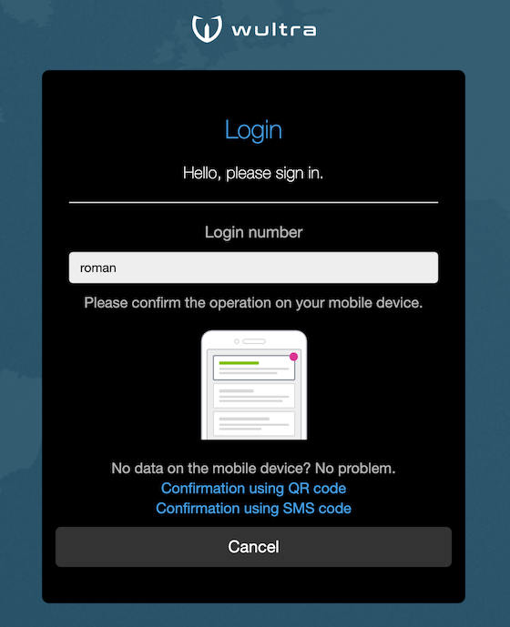 

- `Offline mode`: used when the user is offline on mobile device, the user scans a QR code and retypes calculated authorization code. The authorization code is computed using keys on the mobile device and displayed as 16 digits separated into four groups for easier retyping. Once user retypes the code, the web application verifies the code by calling PowerAuth server.

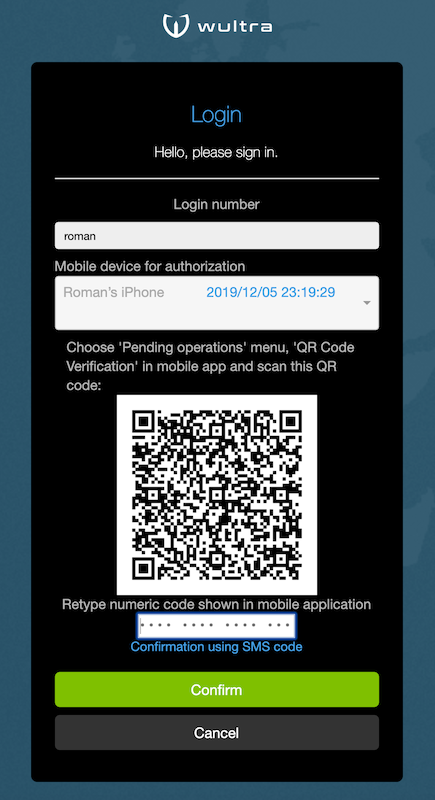

The Mobile Token calculates the authorization code using a two-factor PowerAuth signature which signs the operation data. The authorization is completed
by successfully verifying the signature in PowerAuth server. In case signature verification fails, the authorization can be reattempted until the 
maximum number of tries is reached and the operation fails.

## Consent Approval

The consent screen displays information about consent which should be approved by the user. One or more consent
options can be displayed and the user needs to check the required options to approve the consent. The consent
text and options differ based on operation (`AISP`, `PISP`, etc).


## Testing Web Flow Using Test Client

1. Download and unpack `powerauth-webflow-testing.zip` file from the [release](https://github.com/wultra/powerauth-docker/releases) section.
1. If needed, modify properties in `application.properties` file.
1. Start the application by `sh start.sh` or `start.bat` command.
1. Open [http://localhost:8888](http://localhost:8888) in browser.

You should see a demo app that has following features:

- Login demo - user authentication for `AISP` (SCA and non-SCA variants)
- Payment demo - user authentication and payment approval for `PISP` (SCA and non-SCA variants)
- Operation authorization demo (by operation ID)

It looks like this:

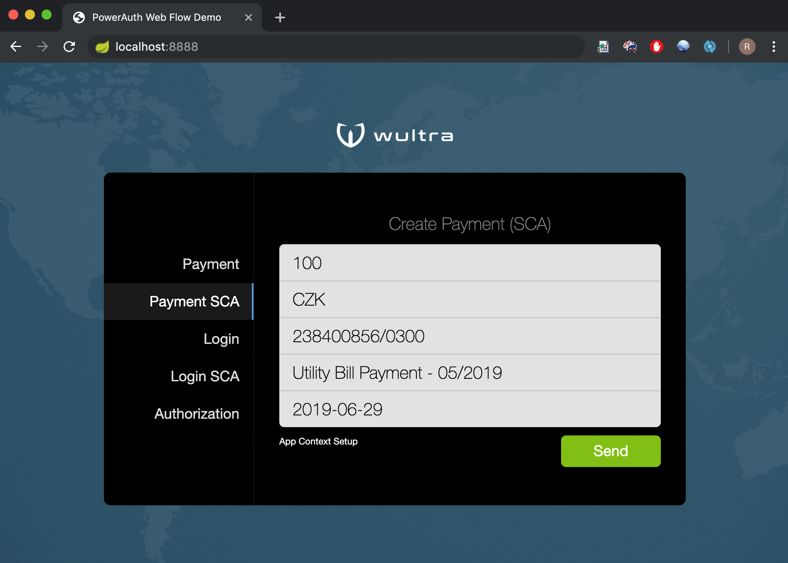

## Generic Behaviour of Web Flow

This chapter describes generic behaviour which is independent on chosen operation and chosen authorization instrument.

| Behaviour | Screenshot |
| --------- | ---------- |
| When all authentication steps are successfully completed for an operation, the user is redirected back to the original application with a success message. |  |
| In case of a critical error or timeout the error message is displayed and user is redirected to the original application with an error message. | 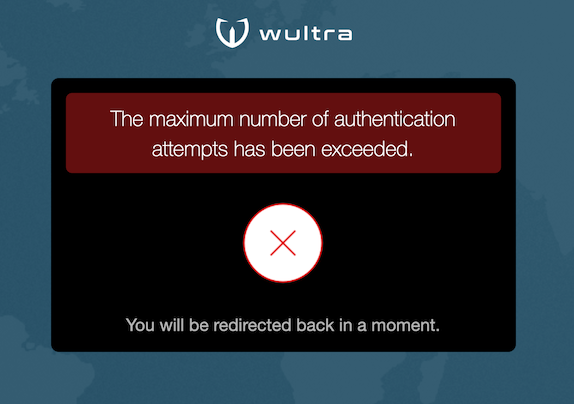 |
| Each operation can be canceled any time using the Cancel button. In this case the user is redirected to the original application which triggered the authentication flow. | 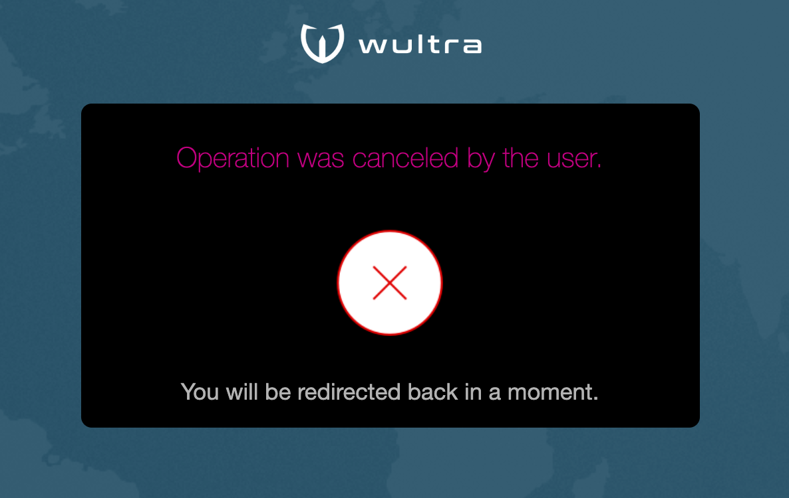 |
| The user interface should not leak information whether user account is active or not. For this reason the authentication form appears active even for non-existent users or blocked accounts. | 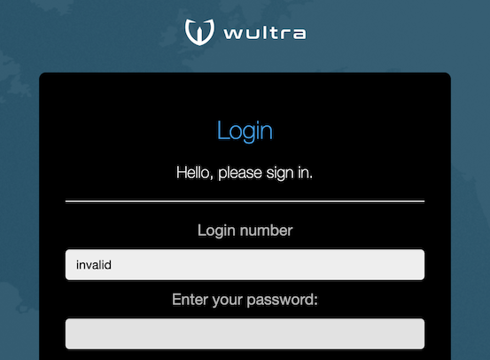 |
| The error messages should not leak information about which authentication method failed (SMS verification or password verification). Thus generic error messages are shown for authentication errors. | 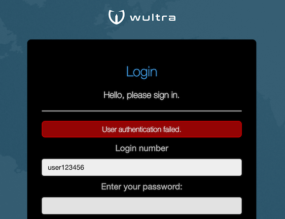 |
| In case of critical errors (e.g. application backend is not running) no details should leak with information about application internals, only a generic error message should be displayed. |  |
| Each operation has timeout of 5 minutes. The timeout is reset back to 5 minutes every time user performs an activity such as attempt to authorize the operation step. When timeout is exceeded, the user is redirected to the original application which triggered the authentication flow. |  |
| A timeout warning should appear 1 minute before actual timeout (after 4 minutes of inactivity), unless the user extends the timeout by some activity, such as authorization of a step or failure to authorize. | 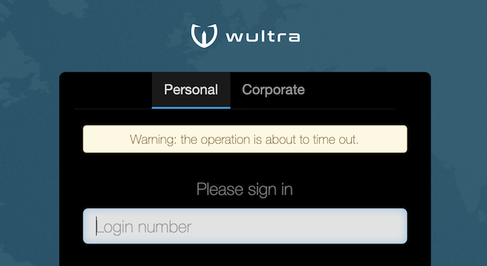 |
| The user can switch language during any time and the page updates to reflect the change of language. |  |
| The user account can be `Personal` or `Corporate` and the user can switch the segment in first authentication step. |  |
| A security warning should appear when the application is used from an Android device. The user can override the security warning and continue with the authentication. | 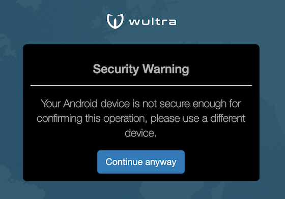 | 
| In case the user tries to refresh the page a confirmation dialog appears. The refresh action interrupts operation which is in progress. | 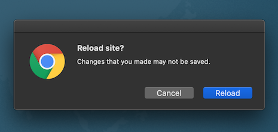 |
| In case the user tries to navigate away from the page or close browser window a confirmation dialog appears. The navigation action interrupts operation which is in progress. |  |

## Login SCA Testing (AISP)

- AISP contains only a user authentication step, there is no approval step. 
- AIPS contains a consent step.
- AISP operation can be triggered by choosing `Login SCA` in the test client. There is no data required to be signed for this operation.  
- The very first screen is used for entering the username.
  - If the username is empty, an error appears.
  - Up to 256 characters can be entered into the username field.
  - If the username validation fails, an error appears. The validation following regular expression is used for username validation: ```^[a-zA-Z0-9_\\-@./\\\\:;<>!#$%&'\"*+=?^`(){}\\[\\]|~]{4,256}$```.
  - In case the username validation succeeds, the user is moved to the next screen.  
- In case the user account has a configured PowerAuth activation, a Mobile Token authentication screen appears.
  - The user can request a fall back to SMS authorization. In this case the initial authorization SMS is sent after clicking the SMS fallback link.
- In case the user account does not have a configured PowerAuth activation, the SMS and password authentication screen appears.
  - The initial authorization SMS is sent after clicking the Continue button.
  - The language of the SMS text is based on the language selected in the web application.
- In a real implementation, in case the user account does not exist, the SMS and password authentication screen appears and pretends that the account
 is active to avoid detecting which accounts exist and which do not. 
  - In this case no authorization SMS is sent, however the application pretends that the authorization SMS was sent.
- The user has 5 attempts for authentication using password and SMS.
  - Up to 256 characters can be entered into the password field. The typed characters are not displayed, an asterisk is used instead.  
  - Up to 8 characters can be entered into the SMS authorization code field.  
- In the default implementation any valid username can be used with password `test` for successful authentication.
- The SMS authorization code can be found in table `da_sms_authorization`.  You need to order records by `timestamp_created` column to see only the latest SMS OTP codes. The SMS OTP code is stored in column `authorization_code`. By default, you can connect to it using following credentials:

| parameter | value |
|---|---|
| URL | `jdbc:mysql://localhost:23376/powerauth` |
| username | `root` |
| password | `root` |
| table name | `da_sms_authorization` |

- The same authorization code can be retried up to 5 times with different or same password before the operation fails.
- The user can request resending of SMS.
  - A new SMS record appears in table `da_sms_authorization`.
  - The previous SMS authorization code is no longer active.
  - After sending a SMS the link becomes active again after 1 minute.
  - When language is switched, the authorization SMS is not sent. 
    - The user can request another SMS which will be sent in language currently selected by user.
- The error message is the same for case when password verification fails or SMS authorization code verification fails,
so that it is not possible to identify which value was invalid.
- Once the user authentication succeeds, the user is redirected to the consent step.
  - The consent step has one option and can either be confirmed or rejected.
  - The operation succeeds only when the consent step is confirmed.

## Payment Authorization Testing (PISP)
- PISP has an authentication step, an approval step and a consent step. 
- PISP operation can be triggered by choosing `Payment SCA` in the test client. The payment operation contains data with payment detail. 
- The testing of login step during payment is the same as in case of AISP, except the next step is an approval step.
- The approval step contains information about payment.
  - You can change the payment details in the test client before triggering the payment operation.
- The user can change the bank account from which the payment will be sent in case the bank account information is available and user has multiple bank accounts.
  - It is possible to complete the approval step even in case the balance is not positive.
- The user needs to approve the payment details before continuing with the payment step authorization.  
- SMS authorization code and password verification as well as Mobile Token authorization are identical to login step in AISP.
- Once both login and approval steps are completed, the consent step loads and it must be approved.

## Operation Authorization Testing

The `Authorization` option in the test client is used for authorizing a previously created operation.

- A custom AISP operation can be triggered by following command:
```
curl --request POST \
  --url http://localhost:8080/powerauth-nextstep/operation \
  --header 'content-type: application/json' \
  --data '{
  "requestObject": {
    "operationName": "login_sca",
    "operationData": "A2",
    "params": [],
    "formData": {
      "applicationContext": {
        "id": "democlient",
        "name": "Demo application",
        "description": "Web Flow demo application",
        "originalScopes": [
          "aisp"
        ],
        "extras": {
          "applicationOwner": "Wultra"
        }
      }
    }
  }
}'
```

- A custom PISP operation can be triggered by following command:
```
curl --request POST \
  --url http://localhost:8080/powerauth-nextstep/operation \
  --header 'content-type: application/json' \
  --data '{
  "requestObject": {
    "operationName": "authorize_payment_sca",
    "operationData": "A1*A100CZK*Q238400856/0300**D20170629*NUtility Bill Payment - 05/2017",
    "params": [],
    "formData": {
      "title": {
        "id": "operation.title"
      },
      "greeting": {
        "id": "operation.greeting"
      },
      "summary": {
        "id": "operation.summary"
      },
      "config": [],
      "parameters": [
        {
          "type": "AMOUNT",
          "id": "operation.amount",
          "valueFormatType": "AMOUNT",
          "amount": 100,
          "currency": "CZK",
          "currencyId": "operation.currency"
        },
        {
          "type": "KEY_VALUE",
          "id": "operation.account",
          "valueFormatType": "ACCOUNT",
          "value": "238400856/0300"
        },
        {
          "type": "KEY_VALUE",
          "id": "operation.dueDate",
          "valueFormatType": "DATE",
          "value": "2017-06-29"
        },
        {
          "type": "NOTE",
          "id": "operation.note",
          "valueFormatType": "TEXT",
          "note": "Utility Bill Payment - 05/2017"
        }
      ],
      "applicationContext": {
        "id": "democlient",
        "name": "Demo application",
        "description": "Web Flow demo application",
        "originalScopes": [
          "pisp"
        ],
        "extras": {
          "applicationOwner": "Wultra"
        }
      }
    }
  }
}'
```

- Either of the previous commands returns an operation ID which should be used in the authorization form:
- The AISP or PISP operation authorization continues with same steps as an operation triggered directly by the test client. 
- See the documentation for [customizing operation form data](./Next-Step-Server-REST-API-Reference.md#operation-formdata) and [customizing operation data](./Operation-Data.md) in case you want to test an operation with custom data.


## Non-SCA Operations

The `Login` and `Payment` operations in the test client do not satisfy SCA requirements of PSD2.
They can still be used in scenarios which are not regulated by PSD2.

There are following differences from SCA steps:
- The login form contains a username and password in one form. It is not required to use two-factor authentication during login.
- The payment form contains a review step with choice of authorization options. The payment approval using SMS OTP code does not require user password because a single factor can be used.